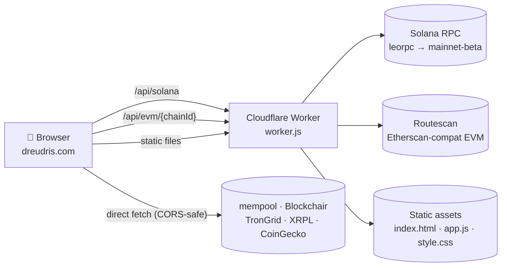

# 🥝 KiwiPit

**Live at [dreudris.com](https://dreudris.com)** — a multi-chain crypto wallet viewer.

Paste any wallet address (or several) and see balances and recent transactions across 14 chains. No accounts, no API keys, no tracking.

## Features

- **Auto-detects the chain** from the address format — no chain picker required
- **Multi-wallet portfolio**: paste several addresses, get a per-coin pie chart that aggregates ETH on Mainnet / Arbitrum / Optimism into a single slice
- **Currency switcher**: USD / EUR / BRL, prices from CoinGecko
- **CSV export** of all transactions across all wallets
- **PDF export** of the portfolio summary + wallet cards
- **xpub/ypub/zpub support** for Bitcoin

## Supported chains

| Class | Chains |
|-------|--------|
| UTXO  | Bitcoin (incl. xpub/ypub/zpub), Litecoin, Dogecoin, Bitcoin Cash, Dash |
| EVM   | Ethereum, BNB Chain, Polygon, Avalanche, Arbitrum, Optimism |
| Other | Tron, XRP, Solana |

Data sources (all free, no key): mempool.space, Routescan, Blockchair, TronGrid, XRPL, Solana RPC, CoinGecko.

## Architecture



The two `/api/*` routes proxy through the Worker because the upstreams either block browser requests directly (Solana public RPCs return 403 to browser User-Agents) or fail on iOS WebKit with the opaque `Load failed` (Routescan). Everything else is a direct browser fetch.

## How the code works (plain-English tour)

This section is written for someone newer to JavaScript and web development. It explains the project end-to-end without assuming you've used these tools before.

### The four files that matter

Almost all the code lives in four files at the root of the repo:

- **`index.html`** — the page itself. Defines the input box, the buttons, the empty placeholders where balances and transactions will appear later. Nothing in HTML "runs" — it's a description of the page structure.
- **`style.css`** — what the page looks like. Colors, fonts, spacing, the dark theme.
- **`app.js`** — the brain. This is the JavaScript that runs in your browser. It listens for you typing an address, figures out which chain it's on, asks the right API for the balance, and writes the result back into the HTML.
- **`worker.js`** — a small piece of JavaScript that runs on Cloudflare's servers (not in your browser). It exists for one reason: some crypto data providers refuse requests that come from browsers, so the browser asks our Worker, and the Worker asks the provider on the browser's behalf.

That's it. No build tools, no frameworks, no React. You edit one of those files, save, refresh — the change is live.

### What happens when you paste an address

Let's follow a real example. You paste `0xd8dA6BF26964aF9D7eeD9e03E53415D37aA96045` (Vitalik's wallet) into the input box.

1. **The browser notices you typed something.** In `app.js` there's an *event listener* attached to the input box — a small piece of code the browser runs every time the input changes. To avoid running it on every single keystroke, we wait 150 milliseconds of "quiet" before reacting. (This trick is called *debouncing*.)

2. **`detectChain()` runs.** This function looks at your text and tries to match it against patterns — for example, anything starting with `0x` followed by 40 hex characters is an EVM address; anything starting with `T` followed by 33 specific characters is Tron. These patterns are called *regular expressions* (regex). Order matters: Solana addresses are just base58 characters with no fixed prefix, so we have to check for it *last*, otherwise it would match Tron addresses too.

3. **A chain is identified, the UI updates.** The accent color of the page changes to match the chain (Ethereum = purple, Bitcoin = orange, etc.). This uses a CSS *variable* called `--accent`: instead of hard-coding colors all over the stylesheet, we set one variable and the stylesheet reads from it.

4. **You click "Look up" (or hit Enter).** Another event listener fires. The function `handleLookup()` runs. It first asks CoinGecko for current USD prices (one request, all coins at once), then calls `lookupChain()`.

5. **`lookupChain()` dispatches.** It looks at which chain was detected and calls the matching `api*` function: `apiBtc` for Bitcoin, `apiEvmFull` for EVM chains, `apiSol` for Solana, etc. These functions all do the same kind of work — make a network request, wait for the answer, return it — but each speaks a different provider's "language."

6. **The network request happens.** This uses the built-in browser function `fetch()`. Because the answer doesn't come back instantly, we use `async`/`await` — JavaScript syntax that lets us write "wait for this answer before continuing" without freezing the page.

7. **The response is JSON.** Data providers reply in a text format called *JSON* — structured key-value text that JS can convert into a regular object with `.json()`. From there we can read fields like `result.balance`.

8. **A `render*` function writes the result into the page.** There's no template engine — we just find the right HTML element by its ID (e.g. `document.getElementById('balance')`) and set its text content. The "DOM" (Document Object Model) is the browser's live, editable representation of the page; JavaScript can read and change it.

### Where the Cloudflare Worker fits in

Most chains' APIs are happy to answer requests directly from your browser. But two are not:

- **Solana**: public RPC servers return HTTP 403 ("Forbidden") to browser requests on purpose.
- **EVM transaction lists (Routescan)**: work on desktop but mysteriously fail on iPhones with a generic "Load failed" error. (Every browser on iOS — even Chrome and Brave — is forced by Apple to use Safari's engine underneath, so this affects everyone with an iPhone.)

The fix is to put a tiny middle-man on Cloudflare's servers. The browser asks `https://dreudris.com/api/solana` (same domain as our site, so no browser blocks), and `worker.js` forwards that request to Solana's RPC and pipes the answer back. From the browser's point of view, it's just talking to itself.

`worker.js` is intentionally minimal: it inspects the URL, and if it's `/api/solana` or `/api/evm/...` it proxies; otherwise it hands the request to the `ASSETS` binding, which serves the matching static file (`index.html`, `app.js`, etc.).

### Adding a new chain — what you'd actually change

If you wanted to add, say, a new EVM chain like Base:

1. Open `app.js`, find the `CHAINS` object near the top. Add a new entry following the pattern of an existing EVM chain (`eth`, `bnb`, etc.). The keys (`name`, `symbol`, `color`, `decimals`, `cgId`, `explorer`) are what the rest of the code reads.
2. If the address format is different, add a new branch in `detectChain()`. For an EVM chain, you don't need to — the existing `0x` branch already covers it; you just add a tab to the network selector.
3. Update the hint text in `index.html` so users know the chain is supported.

The rest — fetching, rendering, the pie chart slice, the CSV row — is automatic, because every chain flows through the same generic pipeline. *This is the payoff of the registry pattern: data in one place, behavior reused everywhere.*

### Glossary (skim, don't memorize)

- **DOM**: the live tree of elements that make up the page in the browser. JavaScript reads and modifies it.
- **Event listener**: a function that the browser calls when something happens (typing, clicking, page loading).
- **`async` / `await`**: JavaScript syntax for "do this, wait for the answer, then continue" without freezing the page.
- **`fetch()`**: the standard browser function for making network requests.
- **JSON**: a text format that represents structured data; the de facto language of web APIs.
- **Regex**: a mini-language for matching text patterns. Used here to recognize address formats.
- **CSS variable**: a named value (`--accent`) set once and reused throughout the stylesheet.
- **Cloudflare Worker**: a small piece of JavaScript that runs on Cloudflare's servers instead of in your browser. Used here as a proxy.
- **Proxy (in this context)**: a server that receives your request and re-issues it somewhere else on your behalf, then forwards the answer back.
- **CoinGecko**: a free crypto-price API.
- **wei / lamports / satoshis**: the smallest unit of each chain's native coin. We do math in these integer units (using `BigInt` for EVM, because the numbers exceed JavaScript's safe integer range) and only divide down to a human-readable amount at display time.

## Local development

```bash
npx wrangler dev   # serves at http://localhost:8787
```

No build step. Edit HTML / CSS / JS and refresh.

## Deployment

Cloudflare Workers Builds auto-deploys on push to `main`.
