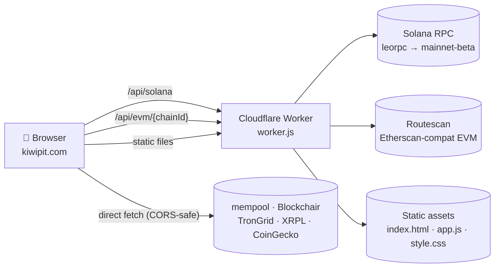

# 🥝 KiwiPit

**Live at [kiwipit.com](https://kiwipit.com)** — a multi-chain crypto wallet viewer.

Paste any wallet address (or several) and see balances and recent transactions across 14 chains. No accounts, no API keys, no tracking.

## Features

- **Auto-detects the chain** from the address format — no chain picker required
- **Multi-wallet portfolio**: paste several addresses, get a per-coin pie chart that aggregates ETH on Mainnet / Arbitrum / Optimism into a single slice
- **Currency switcher**: USD / EUR / BRL, prices from CoinGecko
- **CSV export** of all transactions across all wallets
- **PDF export** of the portfolio summary + wallet cards
- **xpub/ypub/zpub support** for Bitcoin

## Supported chains

| Class | Chains |
|-------|--------|
| UTXO  | Bitcoin (incl. xpub/ypub/zpub), Litecoin, Dogecoin, Bitcoin Cash, Dash |
| EVM   | Ethereum, BNB Chain, Polygon, Avalanche, Arbitrum, Optimism |
| Other | Tron, XRP, Solana |

Data sources (all free, no key): mempool.space, Routescan, Blockchair, TronGrid, XRPL, Solana RPC, CoinGecko.

## Architecture



The two `/api/*` routes proxy through the Worker because the upstreams either block browser requests directly (Solana public RPCs return 403 to browser User-Agents) or fail on iOS WebKit with the opaque `Load failed` (Routescan). Everything else is a direct browser fetch.

## Local development

```bash
npx wrangler dev   # serves at http://localhost:8787
```

No build step. Edit HTML / CSS / JS and refresh.

## Deployment

Cloudflare Workers Builds auto-deploys on push to `main`.
